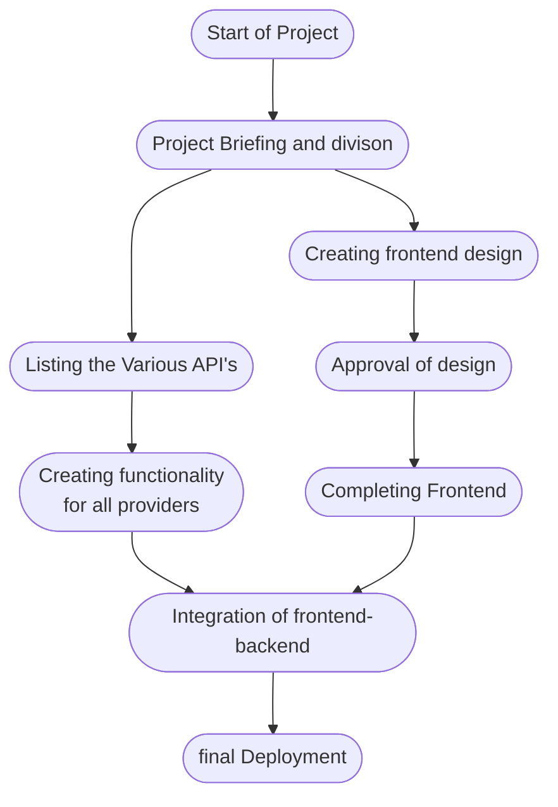

<!--Badges-->
<p align=center>
  <a href="https://github.com/Louis3797/awesome-readme-template/graphs/contributors">
    
  </a>&nbsp;&nbsp;
  <a href="">
    
  </a>&nbsp;&nbsp;
  <a href="">
    
  </a>&nbsp;&nbsp;
  <a href="https://github.com/Louis3797/awesome-readme-template/network/members">
    
  </a>&nbsp;&nbsp;
  <a href="https://github.com/Louis3797/awesome-readme-template/stargazers">
    
  </a>&nbsp;&nbsp;
  <a href="https://github.com/Louis3797/awesome-readme-template/issues/">
    
  </a>&nbsp;&nbsp;
</p>

<div align=center>
 </div>

## :star2: Project Description
> A web app that allows you to migrate your playlists and liked songs from one platform to the other with ease. It could potentially be integrated with the open website. The backend will be on python using the api's of the various music apps.

## :wave: Contributors

<a href="https://github.com/upes-open/Music-Player-Migrator/graphs/contributors">
  
</a>


## Tech Stack 
- [x] Python (Flask or Django)
- [x] HTML, CSS (or React)

### Libraries to be used..
1. spotipy
2. google-api-python-client
3. YouTube Data API
4. google-auth-oauthlib
5. google-auth

## Project Workflow


## Project Screenshots

<div align=right>

</div>

### How to contribute ?

> Star ⭐ and fork the repository... <br>

> Clone the repository on your local machine... <br>
```bash
  git clone https://github.com/upes-open/Music-Player-Migrator.git
```
Go to the project directory

```bash
  cd music-player-migrator-main
```

> Get assigned yourself the issue you want to contribute.<br>

> Start working on the assigned issue.


Contributions are always welcome!

See `contributing.md` for ways to get started.


